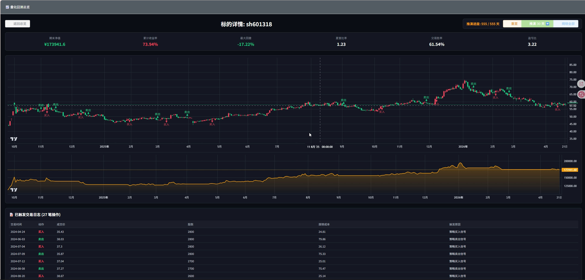
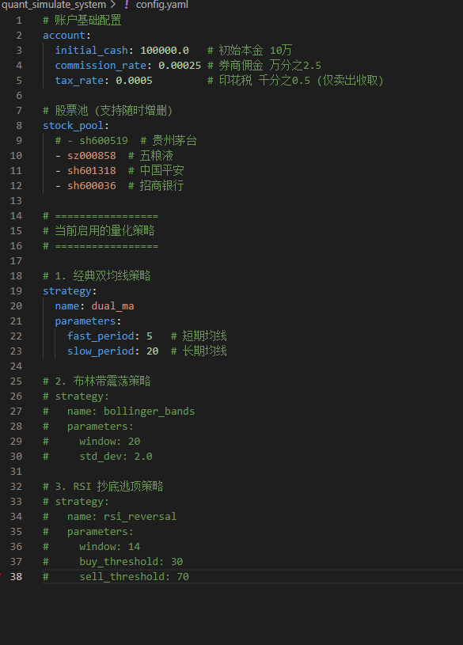
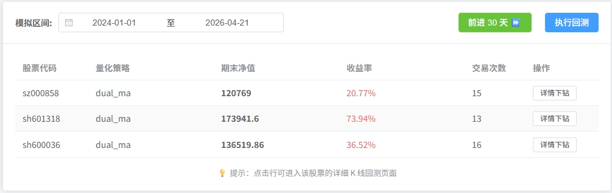
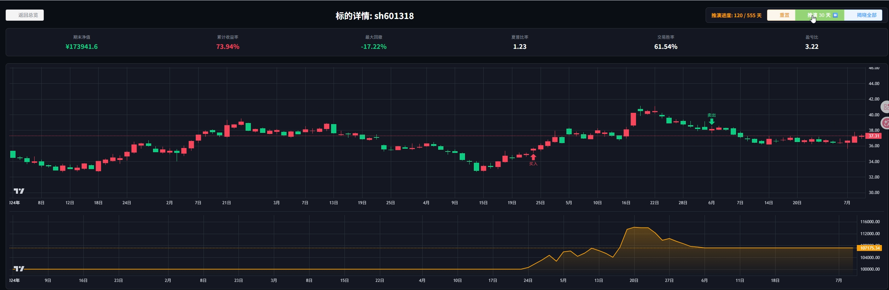
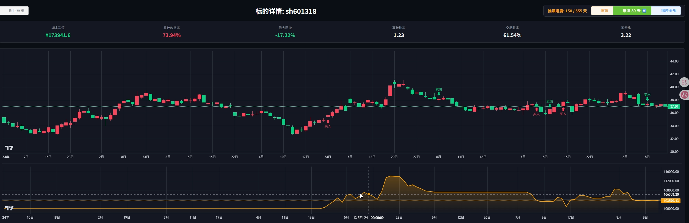

Quant Simulate System (A 股量化回测与时空推演沙盘)
本项目是一个面向 A 股市场的全栈量化回测与模拟交易终端。它不仅提供了传统量化框架的静态回测功能，还创造性地引入了“步进式时空推演引擎”，允许用户以动态的视角观察策略在牛熊转换中的真实表现。

系统采用前后端分离架构，注重界面的专业性（机构级暗黑交易面板）与底层数据的健壮性（防爬虫本地宽泛缓存）。

核心特性
步进式推演引擎：告别“一键看大结局”的回测模式。在单票详情页中，用户可通过每次推进 30 天的方式，动态释放 K 线与买卖点，真实复盘交易决策。

机构级暗黑终端：基于 Vue 3 与 Lightweight-Charts 深度定制，实现 K 线主图与资金曲线副图的时空同步联动缩放。

多维战报指标：内置专业的金融评测体系，实时计算夏普比率、最大回撤、胜率、盈亏比及年化收益。

反爬虫数据中心：接入 AKShare 数据源，内置随机防爬策略与 Parquet 二进制高速缓存机制。数据一次下载，本地永久秒开。

多策略无缝热切：内置经典双均线、布林带震荡回归、RSI 超买超卖等经典策略，可通过配置文件实现一键切换。

技术栈
后端：Python 3, FastAPI, Pandas, AKShare, Uvicorn

前端：Vue 3, Vite, Element-Plus, Lightweight-Charts (v4.2.3), Axios

数据存储：Parquet (本地二进制缓存)

环境安装与运行指南
本项目需要你具备基本的 Python 和 Node.js 运行环境。

1. 后端部署与启动

建议使用虚拟环境运行本项目。

# 克隆项目到本地
git clone https://github.com/你的用户名/quant_simulate_system.git
cd quant_simulate_system

# 创建并激活虚拟环境 (Windows示例)
python -m venv venv
.\venv\Scripts\Activate.ps1

# 安装核心依赖
pip install fastapi uvicorn pandas numpy akshare pyarrow pyyaml

# 启动后端服务
uvicorn backend.main:app --reload
启动成功后，后端服务将运行在 http://127.0.0.1:8000。

2. 前端部署与启动

请保持后端终端运行，新开一个终端窗口进入前端目录。

# 进入前端目录
cd frontend

# 安装依赖 (注意图表库锁定了支持 marker 的 4.2.3 稳定版本)
npm install vue-router pinia axios element-plus dayjs
npm install lightweight-charts@4.2.3

# 启动开发服务器
npm run dev
启动成功后，打开浏览器访问 http://localhost:5173/ 即可进入系统。

配置指南 (config.yaml)
系统的运行高度依赖于项目根目录下的 config.yaml 配置文件。你无需修改代码，只需调整配置即可完成策略回测。

配置项详解
打开根目录下的 config.yaml，其结构分为三部分：
1. 账户基础配置 (account) 用于设定回测的初始物理环境：
•	initial_cash: 初始本金（如 100000.0）。
•	commission_rate: 券商交易佣金（如 0.00025，即万分之 2.5）。
•	tax_rate: 印花税（如 0.0005，系统仅在卖出时计算）。
2. 股票池 (stock_pool) 定义大盘总览页面需要扫描的标的。采用 AkShare 标准代码格式（sh代表上交所，sz代表深交所）。支持随时增减：
YAML
stock_pool:
  - sh600519  # 贵州茅台
  - sz000858  # 五粮液
3. 策略路由与参数 (strategy) 系统采用策略工厂模式，支持热切换。你需要提供策略名称（name）和对应的参数（parameters）。
例如，启用布林带震荡策略：
YAML
strategy:
  name: bollinger_bands
  parameters:
    window: 20       # 计算中轨的周期
    std_dev: 2.0     # 上下轨的标准差倍数
如果你想切换为经典双均线策略，只需将其修改为：
YAML
strategy:
  name: dual_ma
  parameters:
    fast_period: 5   # 短期均线周期
    slow_period: 20  # 长期均线周期
注意：同一时间只能保留一个活跃的 strategy 配置块，其余请使用 # 注释掉。修改保存后，直接在前端页面点击“执行回测”即可生效。

注意事项
防爬虫保护：首次添加新股票代码时，系统需要向云端发起网络请求。若请求频率过高可能会被数据提供方暂时封锁 IP。系统已内置随机休眠和重试机制，若控制台提示多次重试失败，请等待 15 分钟或切换网络后再试。

系统交互指引
大盘总览与区间选择
在系统首页，你可以通过顶部的日期选择器设定全局回测区间。点击“执行回测”后，系统会自动拉取数据并展示股票池内所有标的在该区间的期末净值与收益率。

详情下钻与步进推演
点击表格中的某只股票，将进入暗黑推演终端。
1.	初始化：图表默认仅展示前 60 天的数据作为建仓和技术指标预热期。
2.	推演交互：点击右上角的 [推演 30 天 ⏩] 按钮，时间轴将向后推进一个月。
3.	信号与日志：若该区间内触发了策略逻辑，K 线图上将实时标注买卖点箭头，下方的交易日志表格也会同步新增记录。
[此处插入：点击推演 30 天按钮后，图表出现买入卖出箭头和资金曲线变化的动图或两张前后对比截图]

免责声明
本项目仅供量化交易系统工程学的学习、研究与交流使用。系统内置的策略（如双均线、布林带等）均为教学演示模型，不构成任何投资建议。真实市场存在不可预测的风险，使用本系统产生的一切交易决策和资金盈亏，由使用者自行承担。
