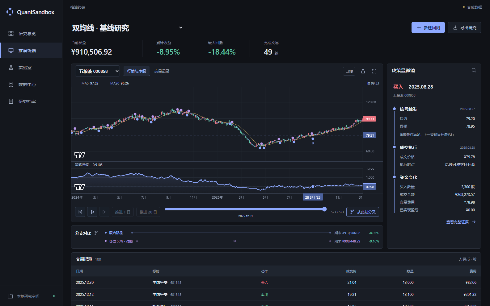

# QuantSandbox 2

本地量化研究工作台：共享资金回测、逐日推演、历史分叉、成交解释、稳健性实验与可重放研究档案。

Vue 3 / TypeScript / Vite / Lightweight Charts；FastAPI / Pandas / SQLite / Parquet。默认使用明确标记的合成行情，安装 AKShare 后可请求真实历史日线。



截图中的价格与绩效来自合成演示数据。

## 启动

需要 **PowerShell 7、Python 3.12+、Node.js 22.12+**。

```powershell
git clone https://github.com/tail258/QuantSandbox.git
cd QuantSandbox
pwsh -File scripts/setup.ps1
pwsh -File scripts/dev.ps1
```

打开 <http://localhost:5173>。`Ctrl+C` 停止本次启动的服务及其计算进程。端口被占用时会报错，可使用 `-ApiPort 8001 -WebPort 5174` 指定其他端口。

安装真实行情依赖：

```powershell
pwsh -File scripts/setup.ps1 -MarketData
```

在「新建回测」选择数据源、日期、股票池、策略与资金参数。真实行情依赖外部服务及本机网络/代理；失败会显示具体错误，不会替换为合成行情。本地合成数据可离线验证完整研究流程。

macOS / Linux 可分别启动服务：

```bash
python3 -m venv .venv
.venv/bin/python -m pip install -r requirements-dev.txt -c requirements-lock.txt
npm ci --prefix frontend
.venv/bin/python -m uvicorn backend.main:app --host 127.0.0.1 --port 8000
# 另一个终端
npm run dev --prefix frontend -- --host 127.0.0.1
```

## 使用

| 页面 | 功能 |
| --- | --- |
| 研究总览 | 创建研究，查看队列、绩效与历史任务 |
| 推演终端 | K 线、资金曲线、成交账本、决策证据、逐日回放及仓位分叉 |
| 实验室 | 费用/滑点/执行延迟等压力情景，参数敏感性，滚动样本外验证 |
| 数据中心 | 数据来源、时间范围、版本和 SHA256 快照指纹 |
| 研究档案 | 笔记、证据包导出、导入后重新计算和结果核对 |

界面以图表和操作为中心；撮合说明收纳于可展开区域。研究指令使用**本地规则解析**填写配置，不接入大模型，也不执行任意生成代码。

## 引擎与复现

- 收盘数据产生信号，最早在该标的下一个可交易日开盘执行；共享一个账户，按代码稳定排序，先卖后买。
- 默认整手 100 股、T+1、最低佣金、卖出税费与双边滑点。手续费进入现金和完整平仓损益，回撤从初始本金计起。
- 双均线、布林带、RSI 和动量四种策略。持有目标由当前条件生成；与旧版仅识别交叉事件的语义有所不同。
- SQLite 保存任务、结果、笔记和盲测会话。计算在独立进程中串行执行，可取消；服务中断的任务被标记失败，需重新提交。
- 分叉复用原数据快照，在指定日收盘后改变策略或仓位。支持多层分叉；检查点是审计记录，**实际计算从起点确定性重放**。
- 导出包含配置、OHLCV、账本、结果、数据指纹和执行时引擎源文件指纹。导入先校验内容，再用当前引擎重算并比较关键结果；指纹用于完整性检查，不是可信机构签名。
- 盲测接口仅返回截止游标的行情、账本和重新计算的指标；揭晓会永久记录。它是本地研究的展示模式，普通研究接口仍可访问完整结果，不能证明使用者未看过未来。

## 研究口径与边界

日线回测是简化撮合模型：不模拟盘口、排队、成交量占比和冲击成本。零成交量或显式停牌/涨跌停字段可阻止成交，但当前 AKShare 数据管道不提供完整涨跌停、ST、板块制度与逐日证券规则；因此不应把结果视为实盘可成交记录。

真实价格目前为**未复权日线**，不计分红送转或退市收益。仓位参数是每次建仓预算比例，不是每天自动再平衡的权重；期末未平仓持仓按收盘估值，不强制卖出。默认等权买入持有基准不含交易费。

合成行情覆盖 2019-01-01 至 2026-09-18，使用工作日历，未模拟交易所节假日；股票名称仅用于操作演示。

压力实验重跑费用、滑点、延迟及仓位情景，不能替代流动性建模。参数实验在同一区间比较参数，最佳值不是样本外证据。Walk-Forward 仅用各训练窗口选参，再推进连续账户的样本外窗口；尚无独立保留的最终测试集。分支结果暂不支持直接运行上述实验，需从基线创建。

## 开发与验证

```powershell
pwsh -File scripts/check.ps1
# 仅后端
./.venv/Scripts/python.exe -m pytest -q
# 仅前端（类型检查 + 生产构建）
npm run build --prefix frontend
# 本地合成数据内核基准（不含下载、磁盘和进程启动）
./.venv/Scripts/python.exe scripts/benchmark.py --symbols 100
```

测试覆盖信号因果性、现金与费用守恒、历史分叉前缀、盲测截断、缓存缺口、证据包重放、进程取消及实验边界。CI 配置为 Windows/Linux 后端测试与前端构建。

本次升级本地验证：**63 项后端测试通过**，TypeScript 检查及生产构建通过，前端依赖审计报告零已知漏洞。浏览器已验证创建回测 → 成交联动 → 历史分叉 → 盲测 → 三类实验 → 笔记与证据包重放；桌面 1586×992 和手机 390×844 无页面横向溢出。真实行情请求在验收环境遇到代理连接错误，因此这些端到端结果基于合成数据。

运行数据保存在 `data/`，可设置 `QUANT_SANDBOX_DATA_DIR` 隔离数据目录。前端开发代理可通过 `QUANT_API_PORT` 指定 API 端口。服务设计为本机单用户使用，默认仅绑定回环地址。

旧 `config.yaml` 仅保留为历史参考；V2 参数在创建研究时提交并随任务持久化。旧版 `/api/backtest` 与结果结构已由任务 API 替代；仓库里的旧截图也不代表 V2 界面。

- [API 契约](docs/API_CONTRACT.md)
- [视觉规范](docs/design/SPEC.md)
- [升级路线图](docs/UPGRADE_PLAN_V2.md)（包含尚未实现的后续阶段）

研究与教学用途；内置策略不构成投资建议。
