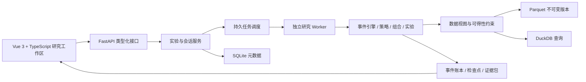

# QuantSandbox V2 全面升级计划

规划日期：2026-09-19。基线提交：`bcdce46`。状态：核心工作台已实施，本文保留完整路线图。

本计划替代上一轮以修复为主的增量升级建议。目标是把项目重建为本地优先、可复现、可解释、支持历史分叉的量化研究工作台。下文保留规划意图；实际能力与限制以 README 为准。

已完成：事件驱动共享资金内核、四种策略、五个工作区、次日撮合与费用账本、数据快照、持久任务与进程取消、成交证据、嵌套分叉、服务器盲测投影、压力/参数/Walk-Forward 实验、笔记、证据包重放、本地规则研究指令、自动测试与启动脚本。

后续范围：检查点快速恢复、分支上的实验、手工交易意图、完整证券与公司行为规则、独立最终保留集、LLM 助理、多用户权限隔离、分钟级数据与实盘连接。当前分叉采用从起点重放，盲测为本地展示模式；不要把路线图描述视为上述能力已经交付。

## 1. 产品目标与默认范围

用户可以完成一条完整研究链：提出假设 → 构建策略 → 固定数据 → 执行实验 → 查看决策依据 → 分叉比较 → 寻找失败条件 → 保存证据。

默认用户为个人研究者和小团队；首先覆盖 Windows、A 股日线、多股票与组合研究。核心研究功能可使用本地数据和离线演示数据运行。分钟级行情、协作服务及模拟盘通过适配器逐步扩展，真实券商下单另立项目边界。

项目实施采用模块重建：重写交易内核、数据管理和前端工作区；保留 Vue、Python、FastAPI、Parquet 的技术基础，迁移现有三类策略的研究意图。旧版本作为比较基线，旧回测结果标记引擎版本，避免与新口径混为一谈。

首发旗舰能力为历史分叉、决策证据链和策略失效实验室。自然语言研究助理作为后续增强。

## 2. 六项有辨识度的能力

### 2.1 历史分叉沙盘

用户在任意已完成的交易日暂停，从同一账户状态生成多个分支，分别改变仓位上限、风控参数、后续策略或手动交易意图。系统比较资金曲线、回撤、风险暴露和成交差异。

- 第一版仅支持交易日结束后的稳定检查点分叉，避免半撮合状态歧义。
- 快照包含现金、持仓与可卖数量、未完成订单、策略状态、指标历史、随机数状态、数据与规则版本。
- 分叉产生独立实验；配置变化从分叉点以后生效。
- 回退通过检查点恢复并重放事件，保持账本完整。
- 支持原策略、修改后的策略和手动干预三个分支同屏对照。
- 参数变更时明确选择继承状态或使用当时可见历史重新预热，记录选择。
- 比较沿用同一段历史行情；它是给定行情下的决策对照，不模拟用户订单改变市场价格的反馈。

验收：无变更分叉与原路径逐笔一致；分叉前账本哈希相同；后续参数不能改写分叉前成交；重启后可恢复同一分支。

### 2.2 决策显微镜

点击成交箭头，可查看“为什么下单、为什么成交或被拒绝”。展示当时价格、指标值、触发条件、策略版本、资金约束、交易规则和费用拆分；未产生订单的观察日也能查询条件是否满足。

基础解释由结构化规则与事件生成。后续语言模型可以转述这些事实，每项结论仍链接到具体事件和数值。

验收：示例交易全部可追溯至信号和订单；解释数值与引擎实际输入一致；解释接口不会返回游标之后的数据。

### 2.3 策略失效实验室

围绕一个已固定的策略版本，系统主动测试：手续费增加、滑点增加、成交延迟、流动性收缩、参数邻域变化、不同起止区间和不同市场环境。输出“在什么条件下失效”，并提供参数热力图及收益—回撤—换手的比较视图。

- 第一版实现可解释的确定性情景矩阵。
- 扩展版支持尊重时间依赖的区块重采样，展示方法、假设及不确定性。
- 自动记录试过多少组参数；最终保留测试集单独管理。
- 回看定义的市场状态只能用于事后归因；用于交易的状态判断只能读取当时可得数据。
- 不将单一合成评分作为策略可靠性的结论，分别显示样本长度、样本外表现、参数敏感性、费用敏感性和数据完整性。

验收：每个情景可单独重放；基准情景等于原实验；搜索过程不会读取保留测试集；全部尝试及失败任务可查询。

### 2.4 人与策略对照复盘

进入盲测会话后，后端只下发当前游标以内的数据和指标。用户可逐日或按指定交易日数量推进，记录手动决策及理由；会话结束后对照策略和买入持有基准。

- “揭晓全部”改变会话状态并记录时间，揭晓后的操作不再计入盲测成绩。
- 已浏览过未来行情的分支不能恢复成未揭晓状态。
- 展示交易纪律、风险暴露和执行差异，避免仅用收益排行评价过程。

验收：网络响应中没有未来 K 线、最终收益或未来信号；同一会话的揭晓记录不可通过界面回退消除。

### 2.5 研究证据包

每次实验保存配置、代码版本、数据清单与哈希、数据可得性说明、费用与撮合规则版本、随机种子、交易账本、图表和结果。可在另一工作区导入并重新执行。

数据状态分开标注：内容已固定、能否支持历史当时可得性、股票池是否存在幸存者偏差。内容哈希只能证明数据未变，不能证明历史上已经可见。

验收：在同一支持环境中重放得到相同规范化账本哈希；跨支持平台对浮点指标使用预先定义的容差；缺失数据或依赖时明确指出差异。

### 2.6 自然语言研究助理

将“比较不同均线周期并增加换手限制”等描述转换为结构化实验草案；展示股票池、参数范围、数据需求和实验规模，再由正常研究工作流执行。可基于实验结果回答问题并引用成交或报告。

- 第一版使用经过校验的策略模板和结构化规则，不自动执行模型生成的任意 Python。
- 模型不可用时，表单、回测、分叉、导出均可正常使用。
- 模型服务可配置；数据发送范围和调用成本可见。
- 先完成可靠的研究接口和证据体系，再接入模型。

验收：自然语言与等价表单产生相同实验定义；非法参数在执行前被拒绝；模型无法构造未注册的操作。

## 3. 六个主工作区

| 工作区 | 用户要完成的事 | 主要界面 |
| --- | --- | --- |
| 研究首页 | 继续最近研究，判断数据与任务状态 | 最近实验、研究笔记、运行任务、数据状态 |
| 数据中心 | 准备可使用、可追溯的数据 | 股票池、覆盖日历、数据版本、质量问题、导入与更新 |
| 策略工作台 | 表达并验证交易逻辑 | 参数表单、条件规则、仓位与风控、版本差异 |
| 推演终端 | 观察、解释和干预历史决策 | K 线、指标、净值、持仓、时间轴、分叉树、证据抽屉 |
| 实验室 | 比较策略并寻找失效条件 | 批量实验、样本外窗口、参数热图、情景矩阵、组合对照 |
| 研究档案 | 保存结论并重现过程 | 实验版本、笔记、证据包、导入导出、重放差异 |

推演终端采用左侧标的与分支、中间图表与时间轴、右侧解释与风控、底部订单及账本的可调节布局。小屏使用独立页签承载相同内容。

视觉方向：石墨色背景、清晰的数字排版、稳定的信息密度；红绿专用于价格与盈亏，另配符号和文本；实验选择与系统状态使用独立配色。支持浅色模式、键盘操作、图表联动、面板尺寸调整和布局记忆。

用户主路径：载入演示研究 → 选择策略 → 运行 → 查看某笔交易 → 在该日分叉 → 修改仓位限制 → 比较 → 执行失效实验 → 保存研究结论。

## 4. 新交易内核

### 4.1 事件与时间

标准流程为市场事件 → 可见数据更新 → 订单撮合 → 账户更新 → 收盘估值 → 策略计算 → 后续订单 → 检查点。具体顺序写入引擎规范，并覆盖公司行动与开收盘事件。

日线默认使用收盘完成后产生的信号，在下一可成交交易日执行。指标预热发生在正式计费绩效区间之前；是否继承区间前的持仓必须显式配置。

策略仅通过受限历史视图访问当前及过去信息；合法指标可以预计算，但必须通过前缀一致性测试。中心窗口、未来回填、全样本归一化等操作不能进入因果策略路径。

### 4.2 账户与撮合

- 支持共享资金的多股票组合、目标权重、定期再平衡、现金储备和单票上限。
- 同一时点的资金分配与订单顺序可重复，默认先处理可执行卖单，再按声明的优先级分配买单。
- 维护总持仓、可卖数量、冻结现金、订单状态和独立成交记录。
- 费用按证券、方向、日期和合同配置计算；用统一的舍入规范处理记账。
- 交易规则按市场、板块、证券属性及生效日期选择，包含最小数量、最小价格单位、可卖约束、涨跌停和停牌处理。
- 单独保存原始价格、研究用调整序列、分红送转事件，明确除权除息的账本处理。
- 日线撮合公开假设；无法从日线判断的盘中顺序不使用有利路径猜测。
- 期末估值、强制平仓、未完成交易的统计方式分别定义。

### 4.3 绩效与研究方法

统一计算累计与年化收益、净值与回撤、波动率、夏普/Sortino/Calmar、交易胜率、盈亏比、换手、持仓期、仓位暴露和基准差额。每项展示公式口径、样本数与不可计算原因。

Walk-Forward 支持滚动及扩展训练窗口、验证窗口和样本外测试窗口；仅拼接样本外收益。重叠标签或持有期造成数据依赖时，按实际依赖设计窗口间隔。账户连续性、窗口再训练时的未完成订单、期末持仓处理均需固定规则。

历史股票池、上市退市、证券名称变化和行业分类必须带时间信息。只有当前股票池时，明确标注覆盖限制，避免宣称已经消除幸存者偏差。

## 5. 数据与存储

采用不可变 Parquet 数据版本承载行情和大规模结果；DuckDB 承担筛选与聚合；SQLite 保存任务、配置、策略版本、研究笔记和版本清单。各自职责独立，避免多个存储重复维护权威账本。

DuckDB 支持对 Parquet 的列选择及过滤下推，适合按标的、日期和字段读取。具体文件大小与分区策略由样本基准决定。[官方文档](https://www.duckdb.org/docs/current/data/parquet/overview)

数据提供器优先实现 AKShare、CSV/Parquet 导入和确定性演示数据。第二在线数据源在字段、复权和授权条件核验后接入；数据源切换产生新版本，不能静默混合。

采集流程：检查覆盖 → 下载缺口 → 字段与交易日验证 → 去重与异常标记 → 临时文件写入 → 原子发布 → 生成清单。复权因子变化时重建受影响的派生序列。

区分事件发生时间、真实可得时间、采集时间和修订时间。数据源无法提供真实可得时间时保留“未知”，不以采集时间推断历史可得性。

外部服务使用明确超时、限流、有限重试和失败分类。质量问题可查看、重试或切换到本地演示。旧缓存以来源和口径未知的数据导入，验证完成后才能用于正式实验。

## 6. 技术架构与模块边界



前端采用 Vue 3、TypeScript、Vite 和 Pinia，增加类型化请求层与统一的任务状态。表单和基础控件沿用成熟组件并统一主题，核心图表与工作台自行组合。路由、图表及实验视图分包。

图表目标为 Lightweight Charts v5，迁移时统一封装 Series 与 Markers，避免业务页面直接依赖版本差异；矩阵和热力图使用单独的图表适配层。[迁移说明](https://tradingview.github.io/lightweight-charts/docs/migrations/from-v4-to-v5)

后端保留 FastAPI，使用类型化配置和请求模型。重计算交给独立 Worker，任务元数据持久化，支持进度、取消、幂等提交、超时与中断恢复。API 通过 SSE 推送状态，并提供轮询回退。FastAPI 的轻量 BackgroundTasks 不承担长时间研究计算。[官方说明](https://fastapi.tiangolo.com/tutorial/background-tasks/)

本地调度采用单一协调者更新任务状态，Worker 写独立结果文件，完成后统一登记。使用任务租约/心跳处理进程退出，避免把数据库加进程池误当成完整任务队列。Windows 使用 spawn 兼容入口，避免模块导入启动子进程。[Python 进程文档](https://docs.python.org/3/library/multiprocessing.html)

普通 Python 子进程用于故障与资源管理，不承诺隔离恶意代码。初期自定义 Python 策略限本机可信代码；接受远程不可信代码前需另行建立操作系统级隔离。

建议目录：

```text
backend/
  api/                 # 路由、请求响应模型、错误协议
  application/         # 实验、会话、分叉、研究流程
  domain/
    events/            # 市场、订单、成交、账户事件
    engine/            # 时钟、撮合、规则、账本、检查点
    strategies/        # 策略协议、指标、规则表达、内置策略
    portfolio/         # 资金分配、再平衡、风险约束
    research/          # 评价、样本外窗口、压力情景
  data/                # 提供器、质量检查、版本、查询
  workers/             # 调度与执行入口
  infrastructure/      # 存储、配置、日志
frontend/src/
  app/                 # 布局、路由、主题
  features/            # 数据、策略、推演、实验、档案
  components/          # 共享控件与图表适配层
  api/                 # 类型化客户端
tests/
  golden/              # 手算账本与已知样例
  invariants/          # 因果性、守恒、分叉一致性
  integration/         # 数据、任务、接口
  e2e/                 # 用户主路径
scripts/               # PowerShell 7、UTF-8 环境与启动脚本
docs/                  # 模型口径、架构决策、使用说明
```

核心对象：DatasetVersion、UniverseVersion、StrategyVersion、RunSpec、Run、Order、Fill、LedgerEntry、Checkpoint、ReplaySession、Branch、Scenario、EvidenceBundle。

RunSpec 固定数据、股票池、策略、费用、交易规则、引擎版本、随机种子及正式绩效区间。规范化定义生成身份标识；运行时日志、耗时等非确定信息不参与账本哈希。

## 7. 分阶段实施与交付门槛

每阶段同时交付用户可操作的功能和相应验证，避免长期只有框架。

| 阶段 | 用户可看到的交付 | 核心工作 | 完成门槛 |
| --- | --- | --- | --- |
| M0 基线与新工程 | 一键启动、离线演示、研究工作区骨架 | 固定依赖，配置迁移，清理跟踪依赖目录，建立审计复现与 CI | 全新环境安装成功；离线完成基础展示；旧问题有回归样例 |
| M1 可信研究闭环 | 配置策略、运行、查看持仓账本与解释 | 新数据版本、事件内核、费用与指标、任务服务、三种策略迁移 | 手算账本一致；无前视；缓存覆盖正确；任务可取消；结果可保存 |
| M2 旗舰推演 | 逐日播放、回退、盲测、分叉对照、决策显微镜 | 检查点、会话游标、分支、证据抽屉、主终端交互 | 无变更分叉等价；盲测不下发未来信息；状态可恢复 |
| M3 研究实验室 | 批量比较、样本外研究、失效条件图 | 实验调度、Walk-Forward、情景矩阵、参数邻域、结果比较 | 保留集隔离；全试验记录；情景可复现；样本外资金口径一致 |
| M4 组合与研究档案 | 多股票共享资金、再平衡、归因、证据包 | 组合分配、资金竞争、基准、研究记录、导入重放 | 同时订单不超用现金；组合账本守恒；证据包可重放 |
| M5 智能研究与发行 | 自然语言实验草案、证据问答、完整本地发行 | 结构化模型适配、成本与数据范围、安装诊断、性能优化 | 模型失效不影响核心功能；等价表单结果一致；完整用户路径通过 |

依赖关系：M0 → M1 → M2 → M3 → M4 → M5。组合的账户结构在 M1 建好，M4 完成分配算法和产品功能，避免后期推倒交易内核。

第一项旗舰交付是 M2；完整 V2 包含 M0—M5。分钟级适配、模拟盘连接、团队权限和远程任务服务作为 V2 后续扩展。数据覆盖条件不足的能力需明确呈现可用范围。

## 8. 验证体系与性能目标

正确性必须通过以下不变量：

1. 前缀一致性：增加未来数据不会改变已经完成的信号、订单和成交。
2. 账本守恒：现金、持仓估值、费用、现金流和总权益能相互核对。
3. 执行等价：一次性运行、分段推进、恢复运行、无修改分叉得到相同账本。
4. 规则一致：不能卖出不可卖数量，不能透支未授权资金，不能越过撮合规则。
5. 数据边界：盲测与策略输入不包含未来可得数据；未知可得性显式标注。
6. 样本外隔离：选参路径不能读取最终保留测试集。
7. 版本复现：相同规范化输入产生同一账本，差异有明确来源。

使用 pytest 和性质测试覆盖上述不变量，使用前端组件测试及 Playwright 覆盖真实用户路径。另建小规模数据源连通测试；核心 CI 使用固定数据，避免行情服务波动导致随机失败。

必须覆盖的特殊样例：只有一天、零交易、首日大跌、连续涨停、停牌、除权除息、样本不足、部分成交、未平仓结束、多个订单竞争现金、缓存损坏、下载中断、参数非法及数据重复。

性能指标是待测目标，不是当前能力承诺。M0 记录目标机 CPU、内存与磁盘后固定测试条件：

- 热缓存下，100 个标的、5 年日线、一个简单策略的标准任务目标不超过 10 秒。
- 已加载日线会话的本地游标更新目标 P95 不超过 100 毫秒；跨检查点恢复单独测量。
- 首屏不等待完整行情下载；图表与实验功能按需加载。
- 任务可取消，长任务有进度；服务重启后能识别中断并从支持的检查点恢复。
- 对参数扫描设定并发、内存和磁盘预算；先测量数据读取、指标计算、撮合和序列化，再决定优化位置。

质量控制包含类型检查、格式检查、依赖审计、接口契约测试和 Windows/Linux 核心测试。依赖修复采用兼容更新及定点回归；主版本迁移单独提交。

## 9. 实施风险与处理

| 风险 | 处理方案 |
| --- | --- |
| 产品范围过大 | 用 M2 作为第一旗舰交付，所有阶段均有用户路径和完成门槛 |
| 分叉难以恢复 | M1 就统一事件、策略状态与检查点协议，限制初期分叉时点 |
| 免费数据无法支持严格历史可得性 | 提供字段能力说明、本地导入和版本标记；不凭空补造历史时点信息 |
| 参数搜索产生过拟合 | 保存全部搜索记录、固定保留集、展示邻域稳定性和样本外结果 |
| 日线成交与真实执行有差异 | 公示撮合模型，提供费用、延迟与流动性情景对照 |
| Windows 进程与中文路径兼容 | PowerShell 7、UTF-8、绝对路径、spawn 入口与实际含空格路径测试 |
| 前端复杂度增加 | 共用时间游标、数据身份和任务状态；图表适配层与模块边界统一 |
| 模型解释出现无依据结论 | 基于结构化证据回答并逐条引用，核心指标由确定性计算产生 |

下一实施动作：M0 工程基线与 M1 数据/交易协议先行，同时定义新终端主路径；随后交付第一条“离线样例 → 策略 → 账本 → 决策解释”的可操作闭环。
